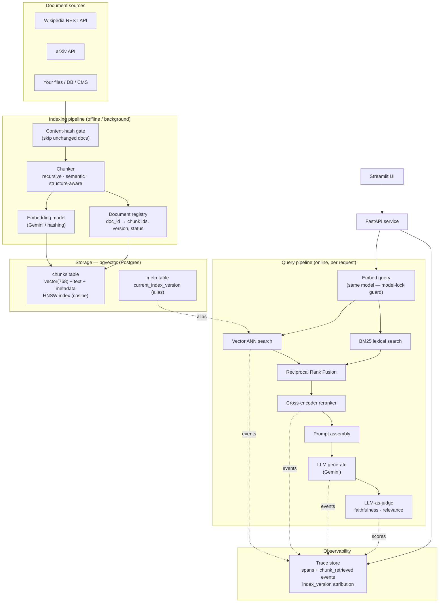
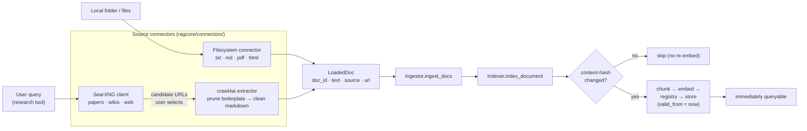
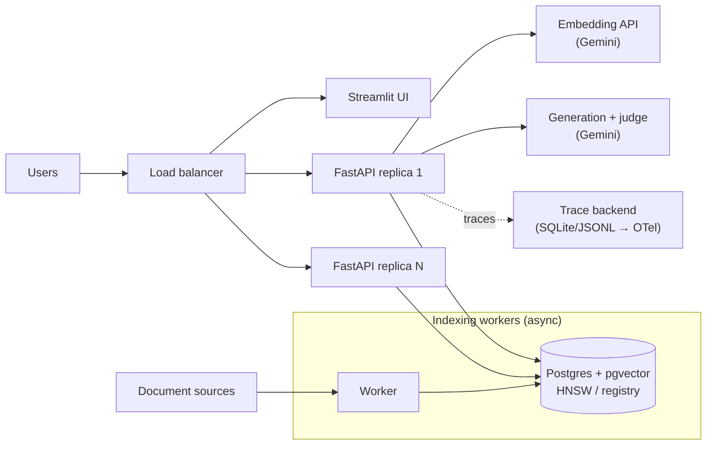

# Production RAG — Architecture

This document describes a Retrieval-Augmented Generation system built to survive
contact with production: a fresh, correct index over time; hybrid retrieval with
reranking; and an observability layer that answers *“why did it retrieve that?”*
It is the concrete implementation of the three things the reference blog argues
separate a demo from a real system:

1. an **indexing pipeline** with a document registry, content-hash change
   detection, correct delete semantics, and alias-based zero-downtime deploys;
2. a **retrieval layer** using hybrid search (vector + BM25) and cross-encoder
   reranking;
3. an **observability layer** with chunk-level attribution, retrieval-quality
   metrics, and index-version → answer-quality correlation.

---

## 1. System overview



Two pipelines run at different times:

* **Indexing (offline)** — ingest → hash-gate → chunk → embed → store, with the
  registry tracking which chunk ids belong to each document version.
* **Query (online)** — embed → vector + BM25 → RRF fuse → rerank → assemble →
  generate → (sampled) judge, emitting one trace per request.

---

## 2. Component design

### 2.1 Chunking (`ragcore/chunking.py`)

Fixed-size character chunking cuts sentences in half and separates questions
from answers. Three production strategies are implemented, each emitting
`Chunk` objects with `doc_id, ordinal, section, char range, content_hash`:

| Strategy    | How boundaries are chosen                                   | Best for                     |
|-------------|-------------------------------------------------------------|------------------------------|
| `recursive` | paragraph → sentence → char fallback, packed to a target    | general prose (default)      |
| `structure` | Markdown headings; every chunk carries its parent section   | docs, manuals, contracts     |
| `semantic`  | boundary where adjacent-sentence cosine drops below a thr.  | topic-shifting long articles |

### 2.2 Embeddings & the model-lock guard (`ragcore/embeddings.py`)

The embedding model is a long-term commitment: every stored vector must come
from the same model used at query time. Each embedder exposes a stable `name`
and `dim`; the `name` is **persisted on every chunk** and the retriever
**asserts it matches the query model** before returning results, turning silent
model drift into a loud `ModelMismatchError`.

* `GeminiEmbedder` — `gemini-embedding-001`, 768-d (production default).
* `HashingEmbedder` — deterministic, dependency-free (offline / CI). BM25 carries
  lexical recall in this mode.

### 2.3 Storage & registry (`ragcore/store/`)

With pgvector, **one `chunks` table is both the vector store and the registry**
(Postgres is both a relational and a vector DB). With an external vector DB
(Qdrant/Pinecone) you keep this table minus `embedding` and let the vector DB
hold vectors keyed by `chunk_vector_id` — the `Store` interface is unchanged.

```sql
CREATE TABLE chunks (
    chunk_vector_id TEXT PRIMARY KEY,
    doc_id          TEXT NOT NULL,
    ordinal         INTEGER NOT NULL,
    text            TEXT NOT NULL,
    section         TEXT NOT NULL DEFAULT '',
    content_hash    TEXT NOT NULL,
    embedding       vector(768) NOT NULL,
    embedding_model TEXT NOT NULL,           -- model-lock metadata
    index_version   TEXT NOT NULL,           -- alias target
    valid_from      TIMESTAMPTZ NOT NULL,    -- MVCC-style staged visibility
    status          TEXT NOT NULL,           -- active | superseded | deleted
    version         INTEGER NOT NULL,
    indexed_at      TIMESTAMPTZ NOT NULL
);
CREATE INDEX chunks_embedding_hnsw ON chunks
    USING hnsw (embedding vector_cosine_ops) WITH (m = 16, ef_construction = 200);
```

Retrieval always filters `status='active' AND index_version=<alias> AND
valid_from <= now()`. Two backends implement the identical interface:
`PgVectorStore` (HNSW ANN, the scale path) and `SQLiteStore` (exact numpy search,
for tests and laptops).

### 2.4 Indexing operations (`ragcore/indexer.py`)

* **Content-hash gate** — `should_reindex` skips a document whose text hash is
  unchanged; metadata-only “updates” never trigger re-embedding.
* **Correct reindex semantics** — an update is *find the doc’s active chunk ids →
  delete them → re-chunk → re-embed → insert the (possibly different count of)
  new chunks*, not an in-place row update.
* **Delete semantics** — deletion soft-marks chunks `deleted` so they drop out of
  retrieval immediately while staying auditable.
* **Index versioning + alias swap** — `rebuild_shadow(new_version)` builds a
  shadow index without touching the live alias; `promote(new_version)` flips the
  `meta.current_index_version` alias atomically. No query ever sees a partial
  index. This is the embedding-model-upgrade / full-rebuild path.
* **Staged visibility** — `valid_from` in the future stages content that becomes
  live only after that timestamp (Postgres-MVCC-like).

### 2.5 Incremental ingestion: source connectors, filesystem & web research (`ragcore/connectors/`, `ingest.py`)

Beyond bulk dataset loading, documents can be added **at runtime, at any time**
from a user action — a local folder, or a web research session (*on-demand corpus
expansion*). The key design point: **incremental ingestion is not a separate
pipeline**. Every source *connector* normalises its input to a `LoadedDoc` and
hands it to the *same* `Indexer.index_document`, so it inherits the content-hash
gate, delete-then-insert reindex, model/version tagging, and — via
`valid_from = now` — becomes queryable immediately, with **no index rebuild**.



**Filesystem** (`connectors/filesystem.py`) — walks a path/glob, extracts text
format-aware (plain text; HTML via BeautifulSoup; PDF via pypdf), and assigns a
stable `doc_id = file:<relative-path>` so re-ingesting updates in place.

**Web research** — two stages, deliberately split so a human reviews before
anything is indexed:

1. **Discovery** (`SearXNGClient`) queries a self-hosted **SearXNG** JSON API.
   Research modes map to SearXNG parameters: `papers → categories=science`
   (arXiv, Semantic Scholar, Google Scholar, PubMed, Crossref), `wikis →`
   Wikipedia engine (with a general-search `wikipedia.org` fallback), `web →`
   general. The endpoint returns candidates only — **nothing is indexed yet**.
2. **Extraction + ingest** (`Crawler`, `load_urls`) crawls the *selected* URLs
   with **crawl4ai**. A `PruningContentFilter` plus `excluded_tags`
   (nav/header/footer/aside) drop site chrome; the result's *fit* markdown is
   then flattened (links → anchor text, images and residual nav lines removed)
   so chunks are clean prose rather than menu boilerplate — this materially
   improves both embedding and cross-encoder rerank quality. crawl4ai is the
   primary extractor; a urllib + BeautifulSoup (and pypdf for PDFs) path is the
   fallback when crawl4ai/Playwright isn't installed. `doc_id` is derived from
   the URL: `arxiv:<id>`, `wiki:<Title>`, or `web:<slug>`, so a crawled arXiv
   paper *deduplicates* against the same paper from the bulk dataset.

Exposed as `POST /ingest/filesystem`, `POST /research/search` (discovery),
`POST /research/ingest` (crawl + index), the **“Add sources”** UI tab, and
`scripts/ingest.py`. SearXNG runs as a compose service; crawl4ai runs in-process.

### 2.6 Retrieval (`ragcore/retriever.py`, `bm25.py`, `reranker.py`)

1. embed query (model-lock checked);
2. dense ANN → candidate set A;
3. BM25 lexical → candidate set B;
4. **Reciprocal Rank Fusion** merges A and B: `score = Σ 1/(k + rank)`;
5. **cross-encoder** (`ms-marco-MiniLM-L-6-v2`) reranks the top fused candidates,
   scoring each (query, chunk) pair jointly;
6. return top-k, each carrying vector / BM25 / fused / rerank scores.

### 2.7 Generation & evaluation (`ragcore/generator.py`, `evaluation.py`)

Generation is grounded: “answer only from the numbered context, cite `[n]`, say
you don’t know otherwise.” An optional, sampled **LLM-as-judge** scores
`faithfulness` and `answer_relevance` and logs them on the trace, giving a
queryable quality signal.

### 2.8 Observability (`ragcore/tracing.py`)

Each request produces a nested span tree with RAG-specific primitives OTel’s
generic model doesn’t capture:

```
rag_request (root)
  ├── embedding.query          (model, dim)
  ├── retrieval.vector_search  (top_k, num_results, index_version)
  ├── retrieval.bm25           (num_results)
  ├── retrieval.fuse           (method=RRF, rrf_k, num_candidates)
  ├── retrieval.rerank         (model, num_input)
  ├── retrieval.select         (chunk_retrieved events — attribution)
  ├── prompt.assembly          (num_chunks_used, total_chars)
  ├── llm.generate             (model, output_chars)
  └── eval.judge               (faithfulness, answer_relevance, rationale)
```

Every retrieval span carries `index_version`, so a quality regression can be
correlated to an index update: filter traces to the new version and compare
faithfulness. Traces persist to SQLite (queryable: *“faithfulness < 0.7 in the
last 7 days”*) and JSONL (shippable to any OTel backend). Chunk-level attribution
is what lets you classify a bad answer as **wrong document** (index/model drift),
**wrong section** (chunking boundary), or **context ignored** (a generation
problem) — three failures that look identical from the outside.

---

## 3. Scaling to 1,000,000 documents

The demo runs a few thousand chunks; the design scales to 1M documents
(~10–15M chunks) without structural change. What changes is *configuration and
topology*, not the code.

### 3.1 Sizing

| Quantity                    | Estimate at 1M docs                                   |
|-----------------------------|-------------------------------------------------------|
| Chunks (~12 / doc)          | ~12M                                                  |
| Vector storage (768-d f32)  | 12M × 768 × 4 B ≈ **37 GB** raw vectors               |
| HNSW graph overhead         | ~1.5–2× raw → ~60–75 GB → keep the index in RAM       |
| Registry rows               | 12M rows in Postgres (trivial)                         |

### 3.2 Vector index

* **pgvector HNSW** handles tens of millions of vectors on one large Postgres
  node. Tune `m` (16–32), `ef_construction` (200–400) at build time and
  `hnsw.ef_search` (100–200) per query to trade recall vs. latency — all exposed
  as `PG_HNSW_*` env vars.
* Beyond a single node, move vectors to a dedicated ANN service
  (**Qdrant / Milvus / Pinecone**) and keep the `chunks` registry in Postgres.
  The `Store` interface already separates these concerns, so this is a new
  `Store` implementation, not a rewrite.
* **Quantization** (scalar/PQ) cuts memory 4–8× for a small recall hit — the path
  to fitting 12M vectors in RAM economically.

### 3.3 Sharding & throughput

* **Shard** the vector index by tenant, corpus, or hash of `doc_id`; fan out
  queries and merge with RRF (the same fusion already used for hybrid search).
* Embedding is embarrassingly parallel — batch and run indexing workers
  concurrently; the content-hash gate keeps re-index cost proportional to change,
  not corpus size.
* BM25 at this scale moves from the in-memory implementation here to **Postgres
  full-text search** or an **OpenSearch/Elasticsearch** index; the retriever’s
  fusion step is unchanged.

### 3.4 Freshness & zero-downtime

* Incremental upserts with `valid_from` stage new content without a rebuild.
* Full re-embeds (model upgrades) use `rebuild_shadow` → validate against a
  benchmark query set → `promote` (alias swap) → keep the old index warm for
  rollback, then GC. This is the Elasticsearch alias pattern.

### 3.5 Serving

* FastAPI service scales horizontally (stateless); the DB/vector store is the
  shared state.
* Cache query embeddings and popular results; the cross-encoder is the main
  latency cost — cap the rerank pool (default: `4 × top_k`).

---

## 4. Deployment topology



### 4.1 GCP deployment (this project)

The generic topology maps cleanly onto managed GCP services. Everything is
deployed under a dedicated **`rag-*`** namespace inside the shared
`ai-storybook-studio` project, fully isolated from the existing `storybook-*`
infrastructure (separate Cloud Run services, a **separate Cloud SQL instance**,
its own Artifact Registry repo, secrets, and service accounts — nothing shared,
nothing mutated). Region: **us-central1**.

```mermaid
flowchart TB
    U["Users"] --> UI["Cloud Run: rag-ui<br/>(Streamlit)"]
    U --> API["Cloud Run: rag-api<br/>(FastAPI + reranker + crawl4ai)"]
    UI -->|RAG_API_URL| API
    API -->|Cloud SQL connector<br/>unix socket| SQL[("Cloud SQL: rag-db<br/>Postgres 16 + pgvector")]
    API -->|research: SearXNG JSON| SX["Cloud Run: rag-searxng"]
    API -->|embed / generate / judge| GEM["Gemini API"]
    API -.reads.-> SEC["Secret Manager<br/>rag-gemini-api-key · rag-db-password"]
    API -.runs as.-> RSA["SA: rag-runtime<br/>cloudsql.client · secretAccessor"]

    subgraph CICD["Continuous delivery"]
        GH["GitHub push → main"] --> GHA["GitHub Actions"]
        GHA -->|WIF (keyless)| DSA["SA: rag-deployer"]
        DSA --> CB["Cloud Build"]
        CB --> AR["Artifact Registry: rag/*<br/>rag-api · rag-ui (per-commit SHA)"]
        AR --> API
        AR --> UI
    end
```

| Component | GCP service | Name | Notes |
|-----------|-------------|------|-------|
| API | Cloud Run | `rag-api` | FastAPI; 2 vCPU / 2–4 GB (torch reranker + Playwright); Cloud SQL attached; runs as `rag-runtime` |
| UI | Cloud Run | `rag-ui` | Streamlit; light image; talks to `rag-api` via `RAG_API_URL` |
| Research | Cloud Run | `rag-searxng` | upstream `searxng/searxng` image; JSON API |
| Vector store + registry | Cloud SQL | `rag-db` | Postgres 16 + pgvector HNSW; **dedicated instance** |
| Images | Artifact Registry | `rag/` | `rag-api`, `rag-ui`, tagged by commit SHA |
| Secrets | Secret Manager | `rag-gemini-api-key`, `rag-db-password` | injected into `rag-api` at runtime |
| Runtime identity | IAM SA | `rag-runtime` | `cloudsql.client`, `secretmanager.secretAccessor` only |
| CD identity | IAM SA | `rag-deployer` | assumed by GitHub Actions via Workload Identity Federation (no keys) |

**Connectivity.** `rag-api` reaches `rag-db` through the built-in Cloud Run
**Cloud SQL connector** (IAM-authenticated unix socket
`/cloudsql/<instance>`), so the database needs no authorized networks and the
existing `storybook-connector` VPC connector is left untouched. `DATABASE_URL`
uses that socket path as the host.

**CD (keyless).** A push to `main` triggers `.github/workflows/deploy.yml`,
which federates a GitHub OIDC token to the `rag-deployer` service account via
**Workload Identity Federation** (pool/provider locked to
`krish-patel1003/RAG`). It builds per-commit images with Cloud Build and rolls
them onto Cloud Run with `gcloud run deploy --image …:<sha>`, which preserves the
service's env/secret/Cloud-SQL configuration from the prior revision. No
service-account keys exist anywhere — important because the repo is public.

**Scaling knobs** carry over: Cloud Run `--min-instances`/`--max-instances` and
`--concurrency` set horizontal scale; `rag-db` is the shared state and moves to a
larger tier (or read replicas) as the corpus grows toward the 1M-doc target in
§3, at which point the vector index can graduate to a dedicated ANN service
behind the same `Store` interface.

---

## 5. Failure modes this design defends against

| Failure                                            | Defense                                                        |
|----------------------------------------------------|---------------------------------------------------------------|
| Serving stale/deleted content                      | registry + soft-delete + `status='active'` filter             |
| Re-embedding unchanged docs (cost)                 | content-hash gate                                             |
| Partial index after a crashed rebuild              | shadow index + atomic alias swap                              |
| Querying model-B against model-A vectors           | `embedding_model` on every chunk + `ModelMismatchError`       |
| “Why did it retrieve that?” is unanswerable        | `chunk_retrieved` attribution events per request              |
| Quality dropped after an index update, cause unknown | `index_version` on every retrieval span                     |
| Confidently wrong answers                          | LLM-as-judge faithfulness/relevance + queryable low-quality set |
```
